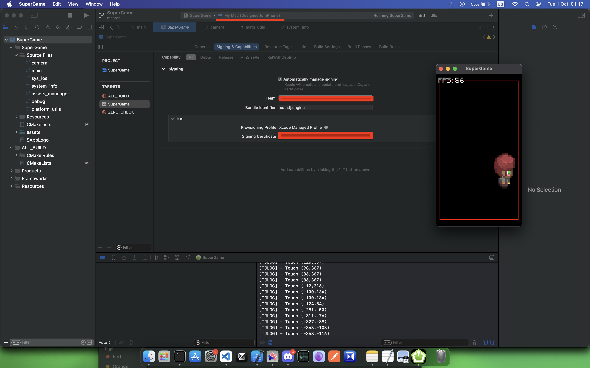

# TapJoy :dash:

## Description

TapJoy is a `CMAKE` and `SFML` project "framework" used to help create games for Windows and Mobile.

> The goals are supporting only the following platforms: Windows, Android and iOS.

## Overview

Windows distributables are built with `Visual Studio 2022 (MSVC)`,
`Android Studio` (Android) and iOS `Xcode`.

> Current supported platforms are:

- [x] Windows
- [x] Android
- [x] iOS (EXPERIMENTAL)

## Dependencies

> The rar file contains the following dependencies, extract it to `dependencies` folder.

- SFML [2.6.x](https://www.sfml-dev.org/)
- JSON [3.11.x](https://github.com/nlohmann/json)
- XML [10.0.x](https://github.com/leethomason/tinyxml2)

## Development and build

- Required tools and toolchains for each platform:

### Windows

- Visual Studio [2022](https://visualstudio.microsoft.com/)
  - C++ [C++ 20](https://en.cppreference.com/w/cpp)
  - MSVC [17.11.0](https://en.wikipedia.org/wiki/MSVC)

### Android

> Tested on Android emulator used Pixel 8 API 30 and Samsung Galaxy A15

- Android Studio [4.1.x](https://developer.android.com/studio/)
  - Androi SDK [34.x](https://developer.android.com/studio/)
  - Android NDK [25.x](https://developer.android.com/ndk/downloads/)
  - Android Command-Line Tools [16.x](https://developer.android.com/studio/command-line)

### iOS

- Xcode [15.4](https://developer.apple.com/xcode/)
  - iOS SDK [12.x](https://developer.apple.com/)

### General

- Tooling
  - Git [2.45.2](https://git-scm.com/)
  - CMake [3.21.x](https://cmake.org/)
  - Vscode [1.93](https://code.visualstudio.com/)

# How to build ? :construction_worker:

- Windows

```bat
mkdir build && cd build

cmake .. -G "Visual Studio 17 2022" -DCMAKE_SYSTEM_NAME="Windows" -A x64

cmake --build .
```

- Android

```sh
cd android
gradle assembleDebug
```

- iOS

1. Generating the `*.xcodeproj`

```sh
mkdir build && cd build

cmake .. -G "Xcode" -DCMAKE_SYSTEM_NAME="iOS"

open ProjectName.xcodeproj

```

2. Linking the framework's and libraries


3. Signing and building
   - Setup the Provisioning signing for iOS
   - Choose the Device
   - Signing and building the application



# Code Style

This project follows [UE Coding Guidelines](https://dev.epicgames.com/documentation/en-us/unreal-engine/epic-cplusplus-coding-standard-for-unreal-engine) even though `SFML` uses camelCase for naming conventions.
